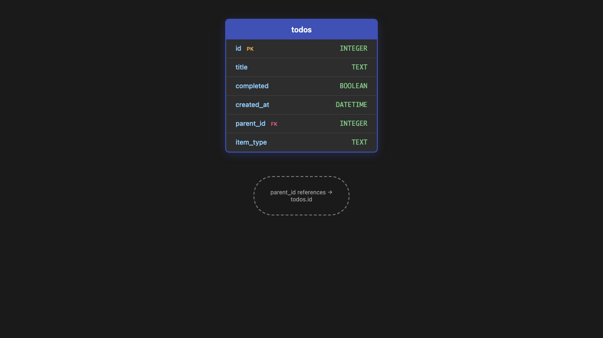
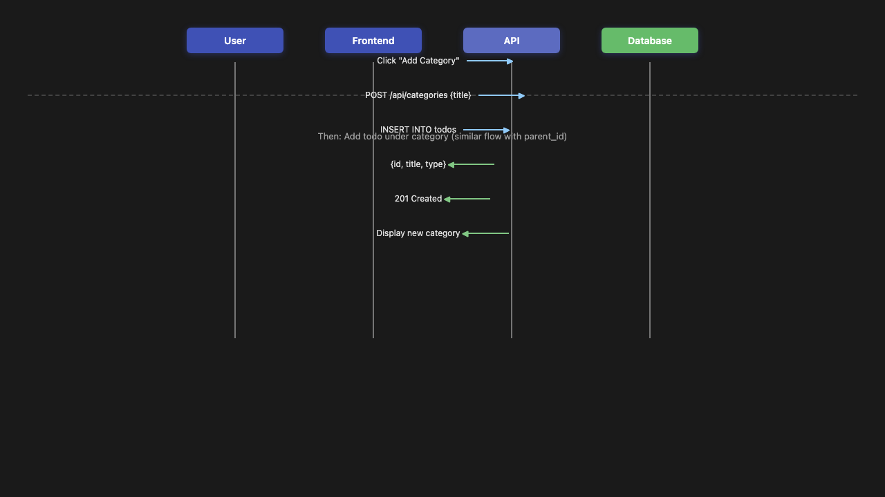
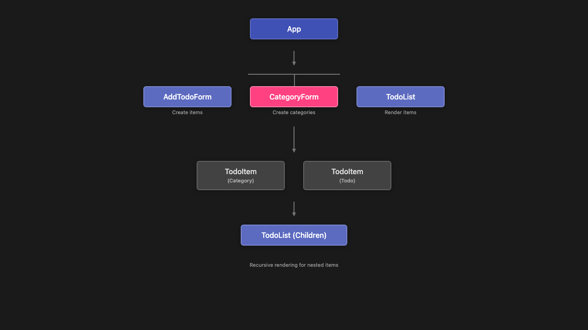
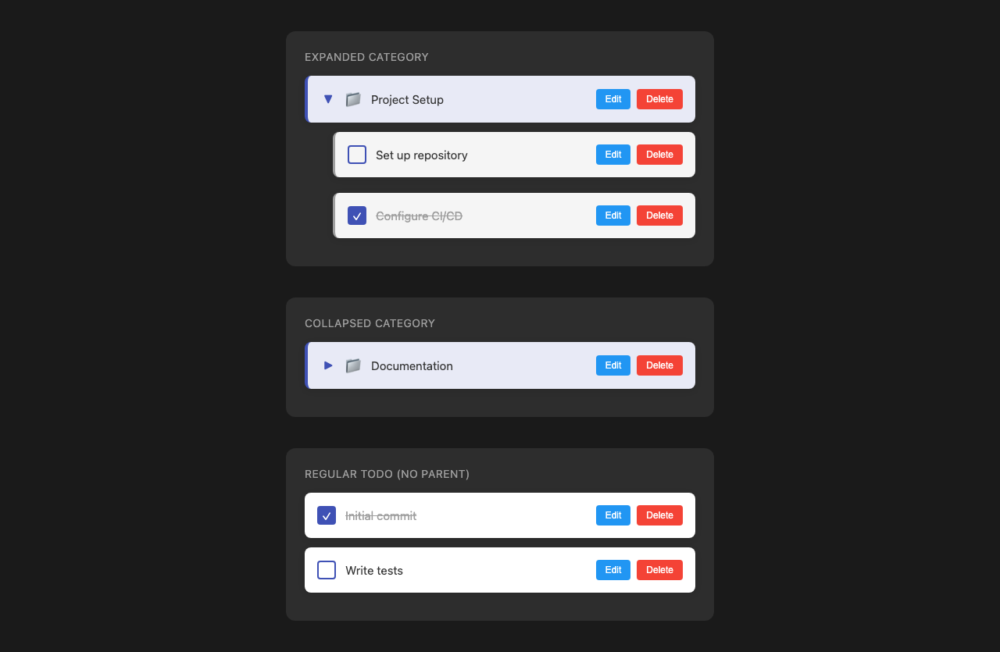

# Issue #1: Add subcategory support to todo items

## Summary

Implement a hierarchical category system that allows users to organize todo items under parent categories, enabling better task organization and grouping within the todo list.

## Root Cause Analysis

**Current State:**
- Todos are flat items with only `id`, `title`, `completed`, and `created_at` fields
- No ability to group related tasks or create hierarchical structures
- Users cannot organize complex projects or workflows effectively

**Desired State:**
- Support for category items that can contain child todos
- Hierarchical parent-child relationships between items
- Visual distinction between categories and regular todos
- Ability to expand/collapse categories to show/hide children

## Proposed Solution

Implement **Option B** from the issue description - a `parent_id` based approach for true hierarchical subcategories. This provides maximum flexibility for nested structures.

**Key Design Decisions:**

1. **Single Table Approach**: Add `parent_id` and `item_type` columns to the existing `todos` table rather than creating a separate categories table. This simplifies queries and maintains backward compatibility.

2. **Item Types**: 
   - `category`: Items that can have children but cannot be completed
   - `todo`: Regular todo items that can be completed and may have a parent

3. **Circular Reference Prevention**: Backend validation to ensure a category cannot be its own descendant.

4. **Cascading Deletes**: When a category is deleted, all child items are also deleted.

## Files to Modify

| File | Change |
|------|--------|
| `server/src/db/database.js` | Add `parent_id` and `item_type` columns to schema |
| `server/src/routes/todos.js` | Add category creation, parent filtering, circular reference validation, cascade delete |
| `electron/src/routes/todos.ts` | Mirror server route changes for Electron build |
| `client/src/types/todo.ts` | Add `parentId`, `itemType`, `children` fields to Todo interface |
| `client/src/api/todoApi.ts` | Add `createCategory`, `fetchTodosByParent`, `deleteCategory` functions |
| `client/src/components/TodoList.tsx` | Support nested rendering, expand/collapse state |
| `client/src/components/TodoItem.tsx` | Visual distinction for categories, expand/collapse UI |
| `client/src/components/AddTodoForm.tsx` | Add option to create categories vs todos |
| `client/src/App.tsx` | Add category creation handler, filter logic |

## New Files

| File | Purpose |
|------|---------|
| `client/src/components/CategoryForm.tsx` | Form component for creating new categories |
| `server/src/utils/categoryValidation.js` | Utility for circular reference detection |

## Implementation Steps

### Phase 1: Database Changes
1. Add migration script to add `parent_id INTEGER` and `item_type TEXT DEFAULT 'todo'` columns
2. Update schema creation to include new columns
3. Add index on `parent_id` for efficient parent-based queries

### Phase 2: Backend API Changes
1. Modify GET `/api/todos` to support optional `?parent=` query parameter
2. Add POST `/api/categories` endpoint for category creation
3. Add GET `/api/categories` endpoint to list all categories
4. Update DELETE to cascade delete children
5. Add validation middleware to prevent circular references
6. Update response serialization to include `item_type` and `parent_id`

### Phase 3: Frontend Type Changes
1. Update `Todo` interface with optional `parentId`, `itemType`, `children` fields
2. Create `Category` type extending `Todo` with specific properties

### Phase 4: Frontend API Changes
1. Add `createCategory(title: string)` function
2. Add `fetchCategories()` function
3. Add `fetchTodosByParent(parentId: number | null)` function
4. Update existing functions to handle new response format

### Phase 5: UI Components
1. Create `CategoryForm` component for category creation
2. Update `TodoItem` to:
   - Display different styling for categories vs todos
   - Show expand/collapse chevron for categories
   - Hide checkbox for categories (they can't be completed)
3. Update `TodoList` to:
   - Support recursive rendering of nested items
   - Manage expand/collapse state per category
   - Group children under parent categories
4. Update `AddTodoForm` to allow choosing between todo and category

### Phase 6: Integration
1. Wire up category creation in App component
2. Implement parent-child relationship UI
3. Add filtering to show only root-level items by default
4. Test expand/collapse functionality

## Test Strategy

### Unit Tests
- **Backend**: 
  - Category creation validation
  - Circular reference detection (A→B→A, A→A)
  - Cascade delete behavior
  - Parent filtering queries
- **Frontend**:
  - CategoryForm submission
  - Expand/collapse state management
  - Nested rendering logic

### Integration Tests
- Create category → add todo as child → verify hierarchy
- Delete category → verify children are deleted
- Update parent_id → verify no circular references
- Toggle todo completion under category → verify parent unaffected

### Edge Cases
- Maximum nesting depth (prevent stack overflow)
- Orphaned todos (parent deleted)
- Empty categories
- Moving todos between categories
- Self-referential parent_id attempts
- Concurrent modifications to same hierarchy

## Risks & Mitigations

| Risk | Mitigation |
|------|------------|
| **Circular references cause infinite loops** | Implement strict validation in backend before any parent_id update; use depth-limited recursion in queries |
| **Performance degradation with deep nesting** | Limit max depth to 5 levels; add database indexes on parent_id; consider materialized path for complex queries |
| **Breaking existing todos** | Make new columns optional with defaults; existing todos remain valid with `item_type='todo'` and `parent_id=NULL` |
| **UI complexity for nested items** | Start with single-level nesting (categories → todos); add multi-level support in future iteration |
| **Cascade delete data loss** | Add confirmation dialog before deleting categories; consider soft-delete with `deleted_at` column in future |

## Diagrams

### Data Model

### API Flow - Create Category with Child Todo

### Component Hierarchy

## UI Mockups

### Category Visual Design

Categories will have:
- **Different background color**: Light indigo tint (`bg-indigo-50`)
- **Chevron icon**: Right-pointing when collapsed, down when expanded
- **No checkbox**: Categories cannot be completed
- **Folder icon**: Visual indicator of category type
- **Nested indentation**: Children indented 24px under parent

### Visual States

## Acceptance Criteria

- [x] Users can create category items
- [x] Users can create todos under a category
- [x] Categories can be expanded/collapsed to show/hide child todos
- [x] Visual distinction between categories and regular todos
- [x] API supports filtering by parent category
- [x] Existing todos continue to work without modification
- [x] Prevent circular references in parent-child relationships

## Future Enhancements

- Drag-and-drop reordering of items
- Multiple categories per todo (tags)
- Category colors and icons
- Category-level completion (complete all children)
- Move todos between categories
- Category templates
- Export/import category structures
