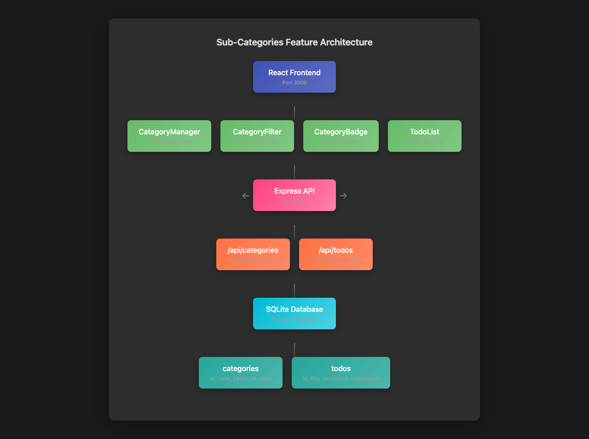
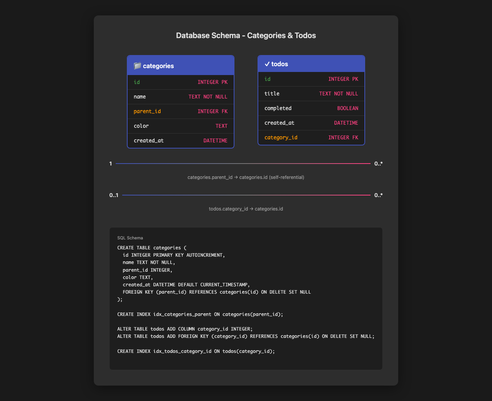
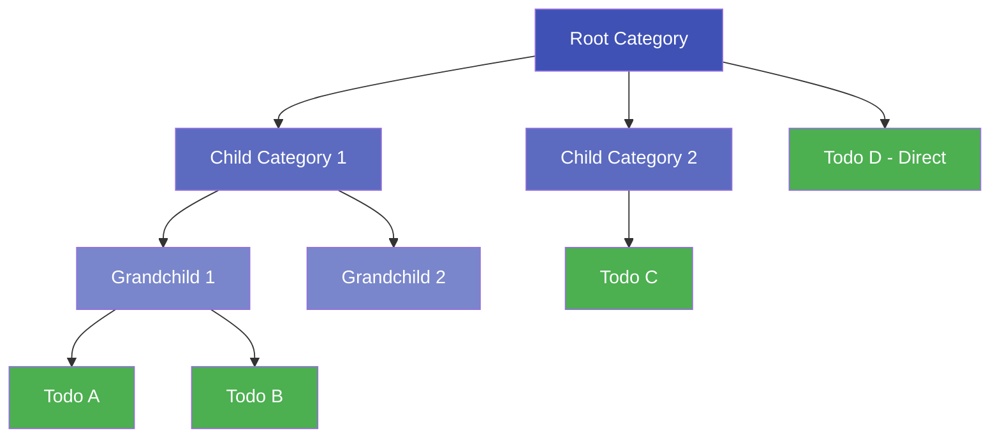
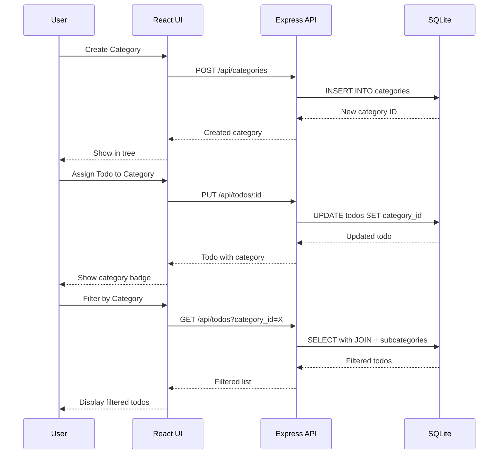

# Issue #2: Add sub-categories support for todos

## Summary

Implement a hierarchical category system that allows users to organize todos into categories and sub-categories with unlimited nesting depth, enabling better task organization by project, context, or priority.

## Root Cause Analysis

**Current State:**
- Todos can only be organized by completion status and creation date
- No categorization or grouping mechanism exists
- Users cannot organize related tasks together

**Desired State:**
- Users can create categories with optional parent-child relationships
- Todos can be assigned to any category level
- Category hierarchy is visually clear in the UI
- Filtering by category includes sub-categories

## Proposed Solution

Implement a self-referential categories table with foreign key relationships, add category assignment to todos, and update the UI to support category management and filtering.

### Key Design Decisions

1. **Unlimited nesting depth** - Parent-child relationships via `parent_id` foreign key
2. **Optional categorization** - Todos can exist without categories (nullable `category_id`)
3. **Cascade deletes** - Deleting a category reassigns child categories to null or deletes them (configurable)
4. **Color coding** - Optional color field for visual distinction
5. **Circular reference prevention** - Validation to prevent categories from being their own ancestors

## Files to Modify

| File | Change |
|------|--------|
| `server/src/db/database.ts` | Add categories table schema, add category_id to todos |
| `server/src/routes/todos.ts` | Add category_id to todo responses, add category filtering |
| `client/src/types/todo.ts` | Add categoryId to Todo interface |
| `client/src/api/todoApi.ts` | Add category filtering parameter to fetchTodos |
| `client/src/App.tsx` | Add category management UI, category filter dropdown |
| `client/src/components/TodoList.tsx` | Display category badges on todos |
| `client/src/components/TodoItem.tsx` | Show category assignment, add category selector |

## New Files

| File | Purpose |
|------|---------|
| `server/src/routes/categories.ts` | Category CRUD API endpoints |
| `client/src/types/category.ts` | TypeScript types for categories |
| `client/src/api/categoryApi.ts` | API client for category operations |
| `client/src/components/CategoryManager.tsx` | UI for creating/editing/deleting categories |
| `client/src/components/CategoryFilter.tsx` | Dropdown to filter todos by category |
| `client/src/components/CategoryBadge.tsx` | Visual category indicator with color |
| `client/src/utils/categoryUtils.ts` | Helper functions for category hierarchy |

## Implementation Steps

### Phase 1: Database Schema (Backend)

1. Create `categories` table migration:
   ```sql
   CREATE TABLE categories (
     id INTEGER PRIMARY KEY AUTOINCREMENT,
     name TEXT NOT NULL,
     parent_id INTEGER,
     color TEXT,
     created_at DATETIME DEFAULT CURRENT_TIMESTAMP,
     FOREIGN KEY (parent_id) REFERENCES categories(id) ON DELETE SET NULL
   );
   ```

2. Add `category_id` column to `todos` table:
   ```sql
   ALTER TABLE todos ADD COLUMN category_id INTEGER;
   ALTER TABLE todos ADD FOREIGN KEY (category_id) REFERENCES categories(id) ON DELETE SET NULL;
   ```

3. Create index for efficient filtering:
   ```sql
   CREATE INDEX idx_todos_category_id ON todos(category_id);
   ```

### Phase 2: Backend API

4. Create category routes (`server/src/routes/categories.ts`):
   - `GET /api/categories` - List all categories (with hierarchy info)
   - `POST /api/categories` - Create new category
   - `PUT /api/categories/:id` - Update category
   - `DELETE /api/categories/:id` - Delete category (cascade handling)
   - `GET /api/categories/:id/children` - Get child categories

5. Update todo routes to support categories:
   - Add `category_id` to todo creation
   - Add `category_id` to todo update
   - Add `?category_id=X` query parameter for filtering
   - Include category info in todo responses (JOIN)

6. Implement circular reference validation:
   - Prevent setting parent_id to self
   - Prevent setting parent_id to any descendant

### Phase 3: Frontend Types & API

7. Create category TypeScript types (`client/src/types/category.ts`):
   ```typescript
   interface Category {
     id: number;
     name: string;
     parent_id: number | null;
     color: string | null;
     created_at: string;
     children?: Category[];
   }
   ```

8. Create category API client (`client/src/api/categoryApi.ts`):
   - fetchCategories(), createCategory(), updateCategory(), deleteCategory()
   - Helper to build category tree from flat list

9. Update todo types and API to include categoryId

### Phase 4: Frontend UI Components

10. Create CategoryBadge component - displays category name with color background

11. Create CategoryManager component:
    - List categories in tree view
    - Add/Edit/Delete category forms
    - Parent category selector (with indentation for hierarchy)
    - Color picker

12. Create CategoryFilter component:
    - Dropdown with category tree
    - "All Categories" option
    - Visual indentation for sub-categories

13. Update TodoItem:
    - Display category badge
    - Category selector dropdown
    - Inherit parent category color styling

14. Update TodoList:
    - Group todos by category (optional view mode)
    - Show category headers

15. Update App.tsx:
    - Integrate CategoryManager
    - Add category filter to todo list
    - Add "uncategorized" filter option

### Phase 5: Testing & Validation

16. Write backend tests for category API endpoints

17. Test circular reference prevention

18. Test cascade delete behavior

19. Test frontend category management UI

20. Test category filtering with nested categories

## Test Strategy

### Unit Tests (Backend)

- **Category CRUD**: Create, read, update, delete operations
- **Hierarchy**: Parent-child relationships, unlimited depth
- **Circular reference**: Prevent self-parent, prevent descendant-as-parent
- **Cascade delete**: Verify child categories handled correctly
- **Todo-category association**: Assign, reassign, remove categories

### Unit Tests (Frontend)

- **Category tree building**: Convert flat list to nested structure
- **Category badge rendering**: Color and name display
- **Filter functionality**: Correct todos shown for selected category

### Integration Tests

- **Full workflow**: Create category → assign todo → filter by category
- **Nested categories**: Create parent → child → grandchild → assign todo to grandchild → filter by parent (should include todo)
- **Delete cascade**: Delete parent category → verify children handling

### Edge Cases

- **Empty categories**: Categories with no todos
- **Deep nesting**: 5+ levels of sub-categories
- **Orphaned todos**: Todos whose category was deleted
- **Circular reference attempts**: Various invalid parent assignments
- **Duplicate names**: Same name in different branches (allowed) vs same parent (should warn)
- **Color validation**: Invalid color codes

## Risks & Mitigations

| Risk | Mitigation |
|------|------------|
| **Circular references in category hierarchy** | Implement validation function that checks all ancestors before allowing parent_id change |
| **Performance with deep nesting** | Add database indexes, limit practical depth to 10 levels in UI, cache category tree |
| **Migration data loss** | Use ALTER TABLE with DEFAULT NULL, existing todos remain uncategorized |
| **UI complexity for category selection** | Use indented dropdown with visual hierarchy, search functionality for large category lists |
| **Delete cascade confusion** | Show confirmation dialog with list of affected child categories and todos before deleting |
| **Color accessibility** | Provide preset color palette with sufficient contrast, allow custom colors with validation |

## Diagrams

### Architecture Diagram



### Database Schema



### Category Hierarchy Flow



### API Request Flow



## UI Mockups

### Category Manager Component

The CategoryManager will display:
- Tree view of categories with expand/collapse
- Add category button (with parent selector)
- Edit/Delete actions per category
- Color picker for each category
- Drag-and-drop reordering (future enhancement)

### Category Filter Dropdown

- "All Categories" at top
- Indented category list showing hierarchy
- Visual color indicators
- Badge showing todo count per category (future)

### Todo Item with Category

- Category badge displayed next to todo title
- Badge shows category color
- Click badge to filter by that category
- Dropdown to change category assignment

## Acceptance Criteria

- [x] Users can create, edit, and delete categories
- [x] Categories can have parent-child relationships (unlimited depth)
- [x] Todos can be assigned to any category
- [x] Todos can be filtered by category (including sub-categories)
- [x] UI clearly displays category hierarchy
- [x] Existing todos remain functional without categories
- [x] Database migration preserves existing data
- [ ] Circular reference prevention implemented
- [ ] Category filtering includes sub-categories recursively
- [ ] Delete confirmation shows affected items

## Out of Scope (Future Enhancements)

- Category templates
- Shared categories across users (if multi-user support added)
- Category-based notifications or reminders
- Category statistics and insights
- Drag-and-drop category reordering
- Bulk category assignment for multiple todos
- Category color presets and themes
- Export/import category structures
