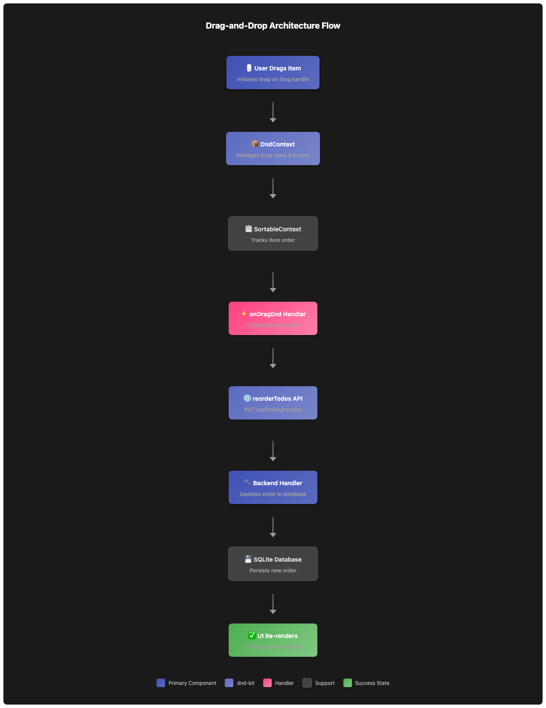
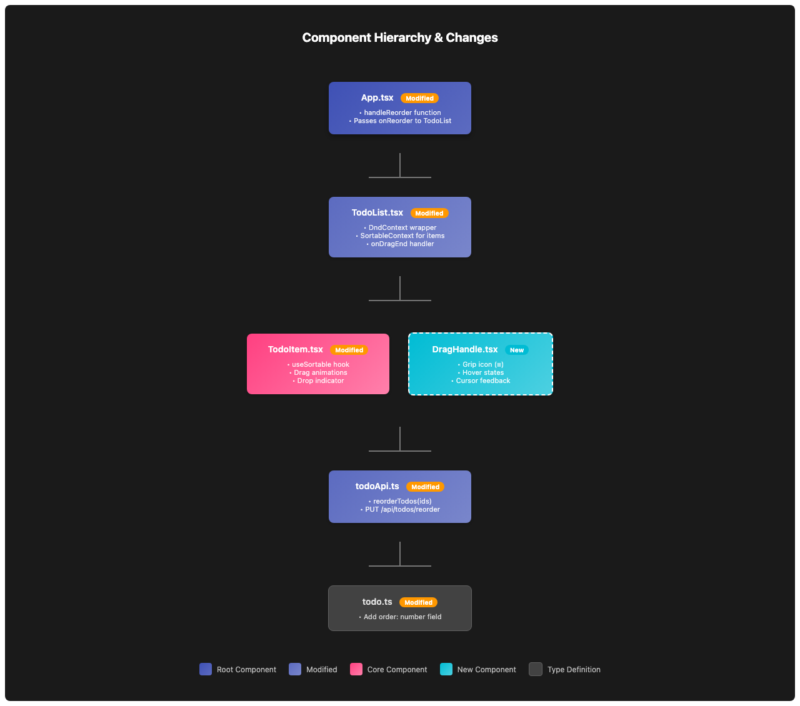
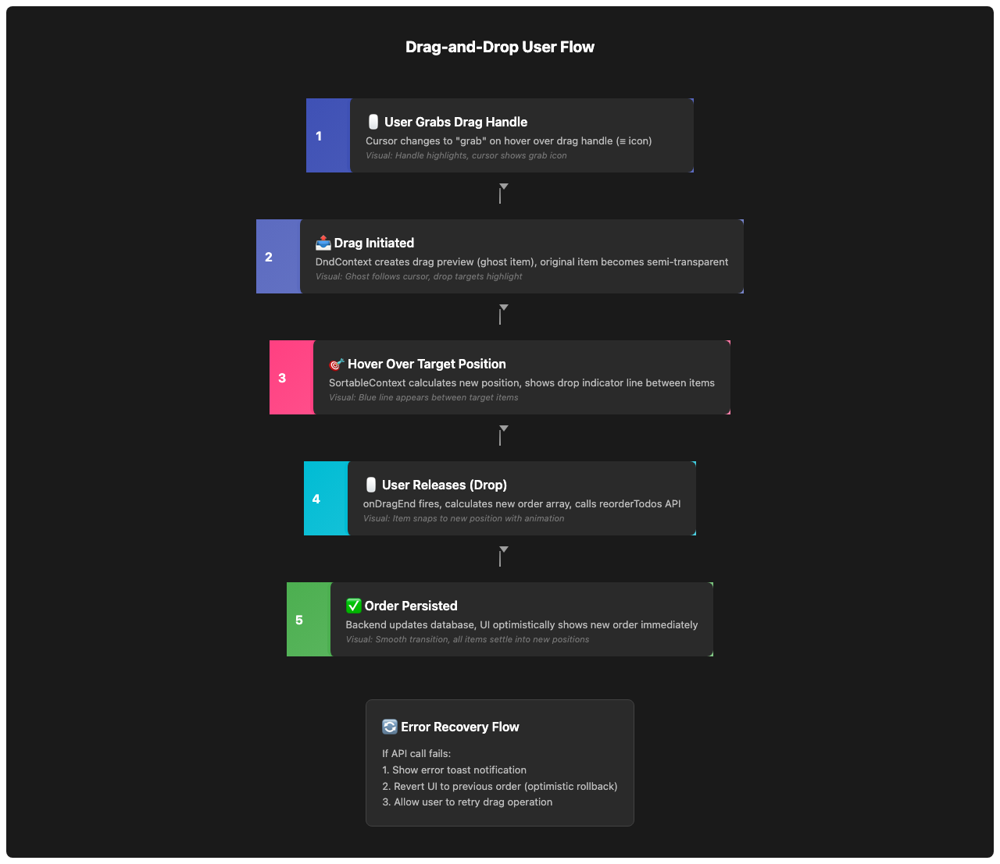

# Issue #3: Implement drag-and-drop list reordering

## Summary
Implement drag-and-drop functionality to reorder todos in the list using @dnd-kit library, with visual feedback during drag operations and persistence to the backend.

## Root Cause Analysis
**Current State:**
- Todos are displayed in a fixed order (by `created_at DESC`)
- No mechanism to reorder items in the list
- Users cannot customize the display order of their todos

**Desired State:**
- Users can drag and drop todo items to reorder them
- Visual feedback shows drag state and drop positions
- New order persists to the backend
- Order is maintained across page reloads

## Proposed Solution
Implement drag-and-drop using the `@dnd-kit` library, which provides:
- Modern, accessible drag-and-drop primitives
- Smooth animations and visual feedback
- Touch and keyboard support
- Lightweight bundle size

The solution involves:
1. Adding an `order` field to the Todo type and database
2. Wrapping the TodoList with dnd-kit's `DndContext` and `SortableContext`
3. Making TodoItem components draggable with visual drag handles
4. Implementing `onDragEnd` handler to update order state
5. Creating a backend endpoint to persist order changes

## Files to Modify

### Frontend (client/)
| File | Change |
|------|--------|
| `client/src/types/todo.ts` | Add `order: number` field to Todo interface |
| `client/src/components/TodoList.tsx` | Wrap with DndContext and SortableContext, add onDragEnd handler |
| `client/src/components/TodoItem.tsx` | Make draggable with useSortable hook, add drag handle |
| `client/src/App.tsx` | Add handleReorder function, pass to TodoList |
| `client/src/api/todoApi.ts` | Add `reorderTodos(ids: number[])` function |
| `client/package.json` | Add @dnd-kit/core and @dnd-kit/sortable dependencies |

### Backend (server/)
| File | Change |
|------|--------|
| `server/src/routes/todos.ts` | Add PUT /todos/reorder endpoint, modify GET to order by `order` field |
| `server/src/db/database.js` | Add `order` column to todos table schema |

## New Files
| File | Purpose |
|------|---------|
| `client/src/components/DragHandle.tsx` | Reusable drag handle component with visual indicator |

## Implementation Steps

### Phase 1: Database Schema Update
1. Add `order INTEGER` column to todos table in database schema
2. Update existing todos with order based on created_at (reverse chronological)
3. Modify GET /todos query to ORDER BY `order ASC`

### Phase 2: Backend API
1. Add PUT /todos/reorder endpoint that accepts `{ ids: number[] }`
2. Implement transaction to update order for all todos in a single operation
3. Return updated todos array

### Phase 3: Frontend Setup
1. Install @dnd-kit/core and @dnd-kit/sortable packages
2. Update Todo type to include `order: number` field
3. Add `reorderTodos` function to todoApi.ts

### Phase 4: Component Updates
1. Create DragHandle component with grip icon
2. Update TodoItem to use useSortable hook
3. Wrap TodoList items with SortableContext
4. Implement onDragEnd handler in App.tsx
5. Add visual feedback styles for dragging state

### Phase 5: Testing & Polish
1. Test drag-and-drop on desktop (mouse)
2. Test on touch devices
3. Test keyboard accessibility
4. Verify order persists after page reload
5. Add loading states during reorder operation

## Test Strategy

### Unit Tests
- **DragHandle component**: Renders correctly, applies correct styles
- **reorderTodos API function**: Sends correct request format
- **Backend reorder endpoint**: Updates order correctly, handles invalid IDs

### Integration Tests
- **Drag and drop flow**: Drag item from position 1 to position 3, verify swap
- **Persistence**: Reorder items, reload page, verify order maintained
- **Multiple reorders**: Perform multiple drag operations, verify final order correct

### Edge Cases
| Edge Case | Expected Behavior |
|-----------|-------------------|
| Drag first item to last | Item moves to end, others shift up |
| Drag last item to first | Item moves to start, others shift down |
| Drag item to same position | No change, no API call |
| Network failure during reorder | Show error, revert to previous order |
| Concurrent reorders (multiple tabs) | Last write wins (optimistic UI update) |
| Empty list | No drag-and-drop available |
| Single item | No drag-and-drop available |

## Risks & Mitigations

| Risk | Mitigation |
|------|------------|
| @dnd-kit bundle size increases load time | Library is lightweight (~10kb gzipped), acceptable tradeoff |
| Touch device compatibility issues | @dnd-kit has built-in touch support, test on mobile |
| Database migration breaks existing data | Use ALTER TABLE with DEFAULT value, backfill existing rows |
| Reorder API called too frequently | Implement debouncing or only call on drag end |
| Visual feedback not clear enough | Add ghost item, drop indicator, and smooth animations |
| Keyboard users can't reorder | @dnd-kit supports keyboard navigation out of the box |

## Diagrams

### Architecture Flow


### Component Hierarchy


### Drag-and-Drop Flow


## API Specification

### New Endpoint: PUT /api/todos/reorder

**Request:**
```json
{
  "ids": [3, 1, 4, 2]
}
```

**Response (200 OK):**
```json
[
  { "id": 3, "title": "Task C", "completed": false, "order": 1, "createdAt": "..." },
  { "id": 1, "title": "Task A", "completed": false, "order": 2, "createdAt": "..." },
  { "id": 4, "title": "Task D", "completed": true, "order": 3, "createdAt": "..." },
  { "id": 2, "title": "Task B", "completed": false, "order": 4, "createdAt": "..." }
]
```

**Error Responses:**
- 400 Bad Request: Invalid ids array format
- 500 Internal Server Error: Database error

## Database Schema Changes

### Before
```sql
CREATE TABLE todos (
  id INTEGER PRIMARY KEY AUTOINCREMENT,
  title TEXT NOT NULL,
  completed INTEGER DEFAULT 0,
  created_at DATETIME DEFAULT CURRENT_TIMESTAMP
);
```

### After
```sql
CREATE TABLE todos (
  id INTEGER PRIMARY KEY AUTOINCREMENT,
  title TEXT NOT NULL,
  completed INTEGER DEFAULT 0,
  order INTEGER NOT NULL DEFAULT 0,
  created_at DATETIME DEFAULT CURRENT_TIMESTAMP
);

-- Index for faster ordering
CREATE INDEX idx_todos_order ON todos(order);
```

## Visual Design

### Drag States
1. **Default**: Normal todo item appearance
2. **Dragging**: Slightly elevated, increased shadow, reduced opacity
3. **Drop Target**: Highlighted border, slight scale up
4. **Drag Handle**: Visible grip icon on hover/focus

### Drag Handle Design
- Three horizontal lines (≡) on the left side of each todo item
- Visible on hover for desktop, always visible for touch
- Cursor changes to `grab` / `grabbing` during drag
